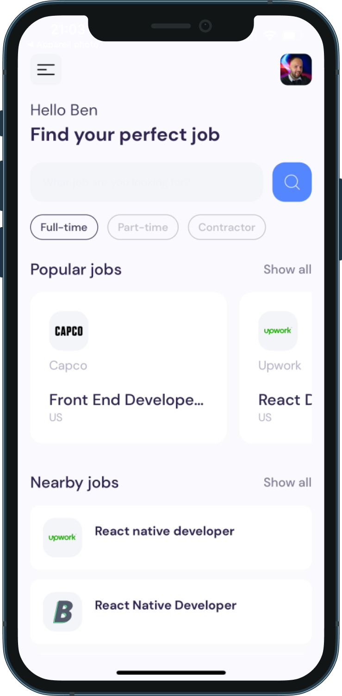
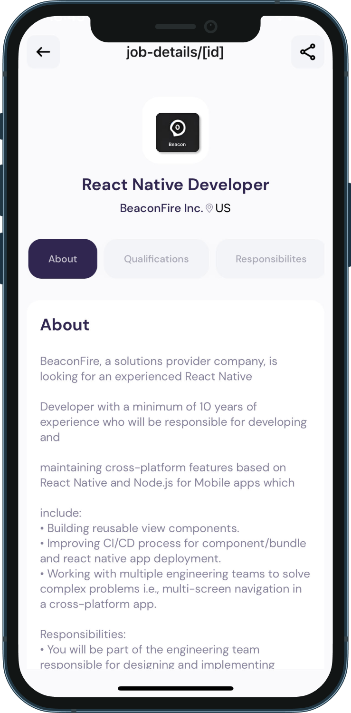

# <span style="color: #5486ff;">**DEVJOBS APP**</span>

#### A mobile application for job search mainly in the tech industry

<div style="margin-top: 30px;"></div>

### **Technologies Used** 🤖

<div style="margin-top: 10px;"></div>


<div style="margin-top: 20px;"></div>
 
***

<div style="margin-top: 15px;"></div>

### **Important**

<div style="margin-top: 10px;"></div>

> This project has been realized with the [RapidAPI]("https://rapidapi.com/hub/") `JSearch` **_API_**, with a limited plan in API data calls.

<div style="margin-top: 10px;"></div>

> So it's normal that the whole data display is not always visible on the two sections of the homepage.

<div style="margin-top: 20px;"></div>

---

<div style="margin-top: 20px;"></div>

### **Provisional Rendering**

<div style="margin-top: 30px;"></div>

- **`Home Page`**



<div style="margin-top: 40px;"></div>

<!-- <div style="margin-top: 30px;"></div> -->

- **`Job Detail Page`**



<div style="margin-top: 10px;"></div>

#

<div style="margin-top: 35px;"></div>

## 🚀 [<span style="font-weight: bold; color: white">How to use</span>](#🚀-how-to-use)

<div style="margin-top: 20px;"></div>

Use [`expo-router`](https://expo.github.io/router) to build native navigation using files in the `app/` directory.

```sh
npx create-react-native-app -e with-router
```

#

<div style="margin-top: 30px;"></div>

### [<span style="font-weight: bold; color: white">Expo router Info</span>](#expo-router-info) 📝

<div style="margin-top: 20px;"></div>

- Find out how to fully use expo router by reading the [_Documentation_](https://expo.github.io/router)

<div style="margin-top: 30px;"></div>

### **Launch of the project**

---

```sh
npm start
```

<div style="margin-top: 30px;"></div>

### **In case of connection problems**

Follow these steps

1. Shut down the server

```sh
Ctrl + c
```

2. Install expo cli with this command :

```sh
npm install -g expo-cli
```

3. Run the command: npm

```sh
expo-cli start --tunnel
```
