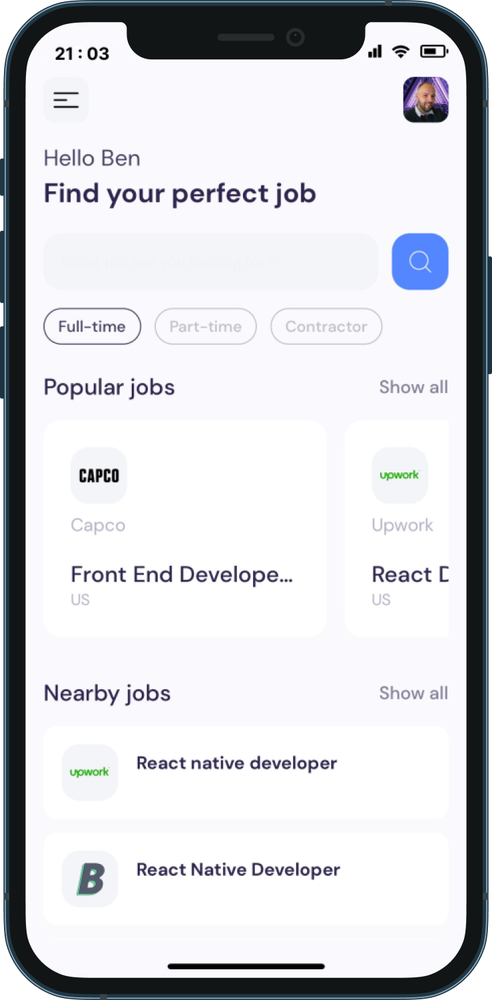
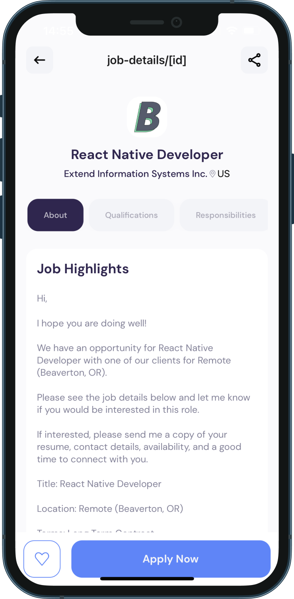

# <span style="color: #5486ff;">**Application Mobile Jobs**</span>

> The **Mobile Jobs App** is a mobile application for searching and viewing job offers for web developers. Users can search for job offers specific to their skillset and apply to those that interest them.

<div style="margin-top: 25px;"></div>

<div style="margin-top: 10px;"></div>

### **Features**

- Job search by keyword and location
- Filter search results by contract type, required experience, and publication date
- View job offer details, including job description, required qualifications, and company information
- Save favorite job offers to a list
- Apply to job offers directly from the application
- Track application status in real-time

<div style="margin-top: 30px;"></div>

### **Technologies Used** 🤖

---

<div style="margin-top: 20px;"></div>

<div>


</div>

<div style="margin-top: 10px;"></div>

- [React Native]("https://reactnative.dev/") React Native hybrid mobile framework to create Android and iOS applications.

- [RapidAPI]("https://rapidapi.com/hub") is a platform that allows to find and connect to APIs.

- [Axios]("https://axios-http.com/") is a promise-based HTTP client compatible with node.js and browsers

- [Expo]("https://expo.dev/") is an open-source framework for apps that run natively on <a style="color: #3dda84; font-weight: bold;text-decoration: none;"  href="https://www.android.com/">Android</a>, <a style="color: #f63e54; font-weight: bold; text-decoration: none;" href="https://www.apple.com/fr/ios/ios-16/">iOS</a>, and the web.

<div style="margin-top: 25px;"></div>

### **Discover the project 😎**

#

By clicking on this link you will be directed to the QR code of the project, scan it to enjoy the project live

<div style="margin-top: 20px;"></div>

<a href="https://expo.dev/@bendevweb/jobs-mobile-app?serviceType=classic&distrribution=expo-go">

</a>

### **Installation 🚀**

---

<div style="margin-top: 10px;"></div>

1. Clone the repository:

```sh
git clone https://github.com/Neocor89/mobile-jobs-app.git
```

<div style="margin-top: 10px;"></div>

2. Install the dependencies:

```sh
npm install
```

or

```sh
yarn install
```

<div style="margin-top: 30px;"></div>

### **Utilisation 👷**

---

<div style="margin-top: 20px;"></div>

> Launch the application in development mode:

<div style="margin-top: 15px;"></div>

```sh
npm start
```

or

```sh
yarn start
```

<div style="margin-top: 15px;"></div>

> You must have an [Expo account]("https://expo.dev/") and install the application on your smartphone to launch the application

or

> Use an **Android** or **iOS** emulator to preview the application.

<div style="margin-top: 20px;"></div>

#### `In case of connection problems Follow these steps`

<div style="margin-top: 10px;"></div>

1. Shut down the server

```sh
Ctrl/Cmd  + c
```

<div style="margin-top: 10px;"></div>

2. Install expo cli with this command :

```sh
npm install -g expo-cli
```

<div style="margin-top: 10px;"></div>

3. Run the command: npm

```sh
expo-cli start --tunnel
```

4. Then scan the QR code with the camera of your Android or IOS smartphone

If you encounter any errors after following these steps, please follow this link to the [Expo installation process]("https://docs.expo.dev/get-started/create-a-new-app/")

#

### **Application Rendering**

<div style="margin-top: 30px;"></div>

- **`Home Page`**



<div style="margin-top: 40px;"></div>

- **`Job Detail Page`**



<div style="margin-top: 25px;"></div>

### **Important** 🚨

<div style="margin-top: 10px;"></div>

This project has been realized with the RapidAPI `JSearch API` , with a **limited plan in API data calls**.

<div style="margin-top: 10px;"></div>

> So it's normal that the whole data display is not always visible on the two sections of the homepage.

<div style="margin-top: 10px;"></div>

#

<div style="margin-top: 15px;"></div>

### **Contribution** 🤝

Contributions are welcome! If you want to contribute to this project, please create a `pull request` on **GitHub**.

<div style="margin-top: 25px;"></div>

### **Authors** 👨‍💻

<div style="margin-top: 15px;"></div>


<div style="margin-top: 15px;"></div>

If you have any **questions** or **comments** about this project, feel free to share them on the GitHub project page.
